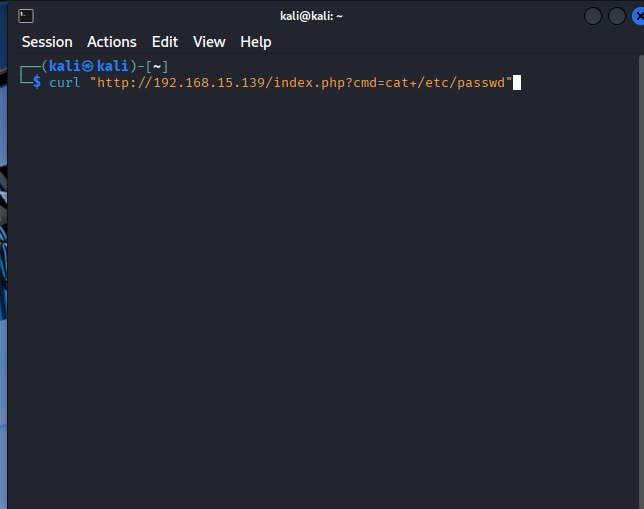
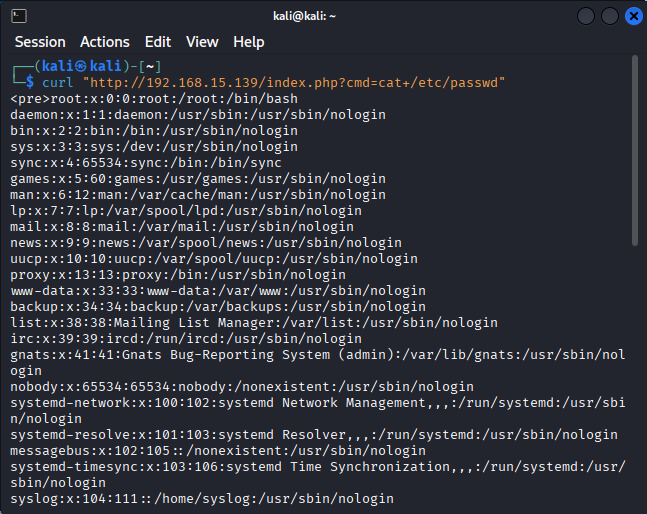
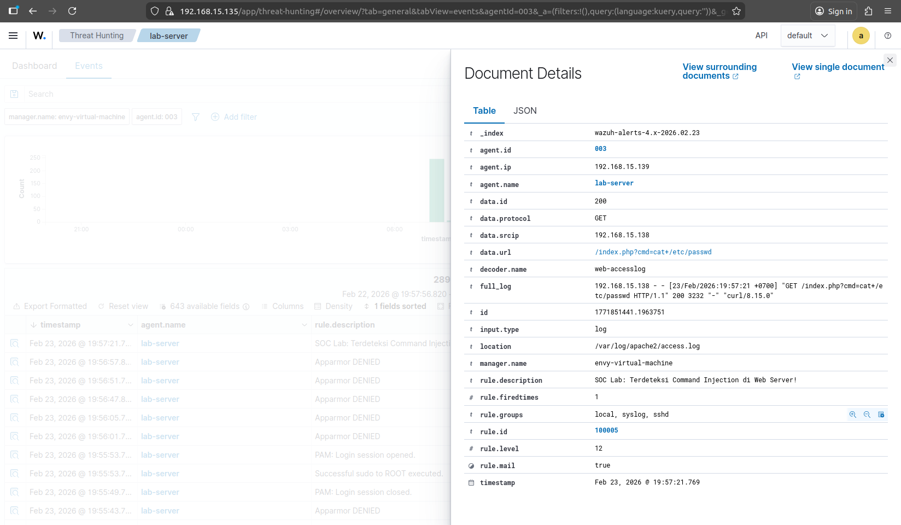
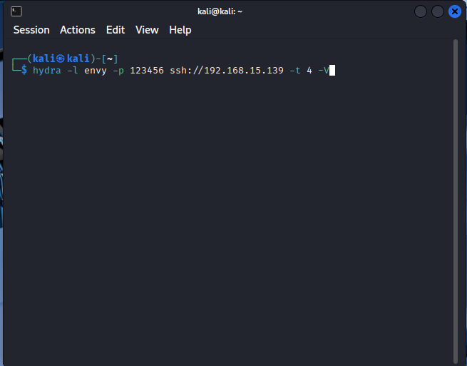
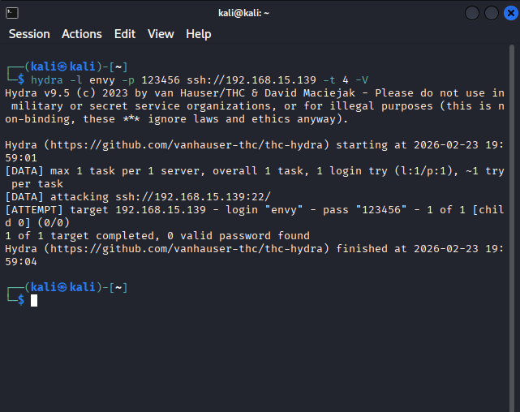
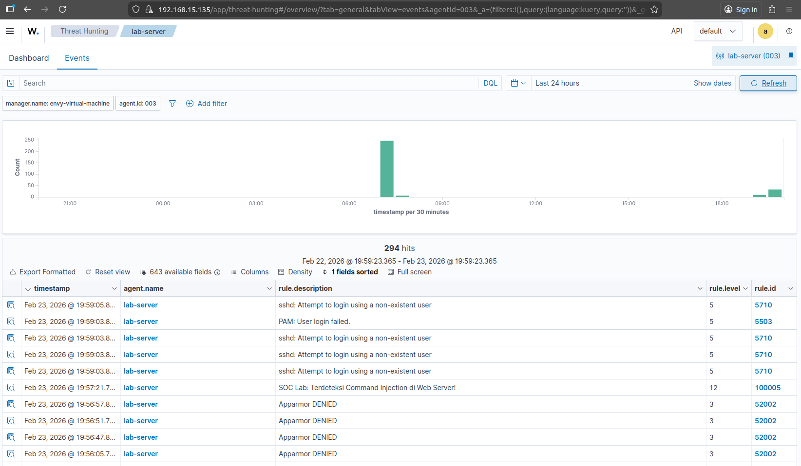
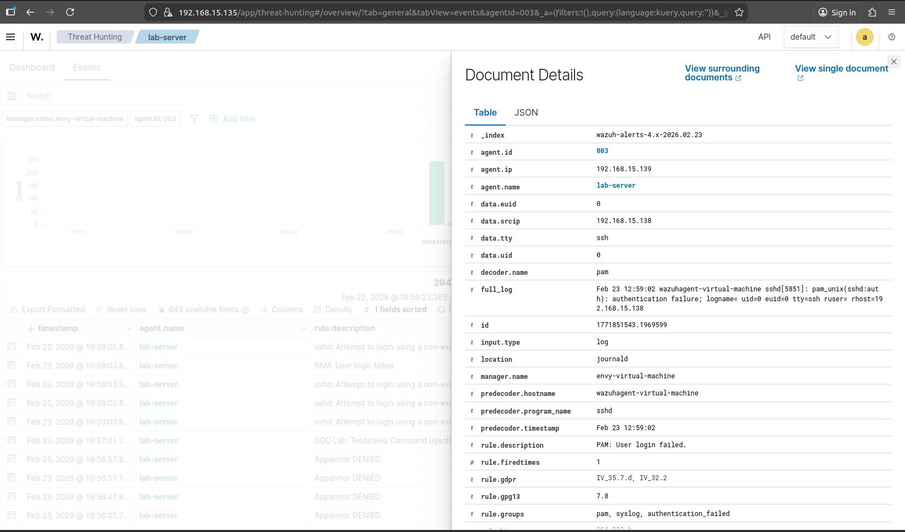
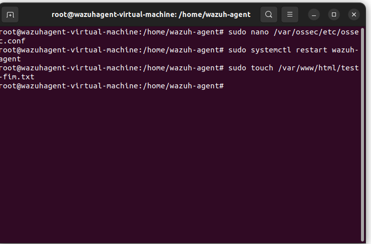
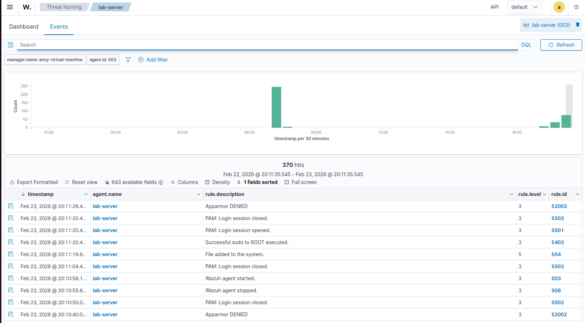
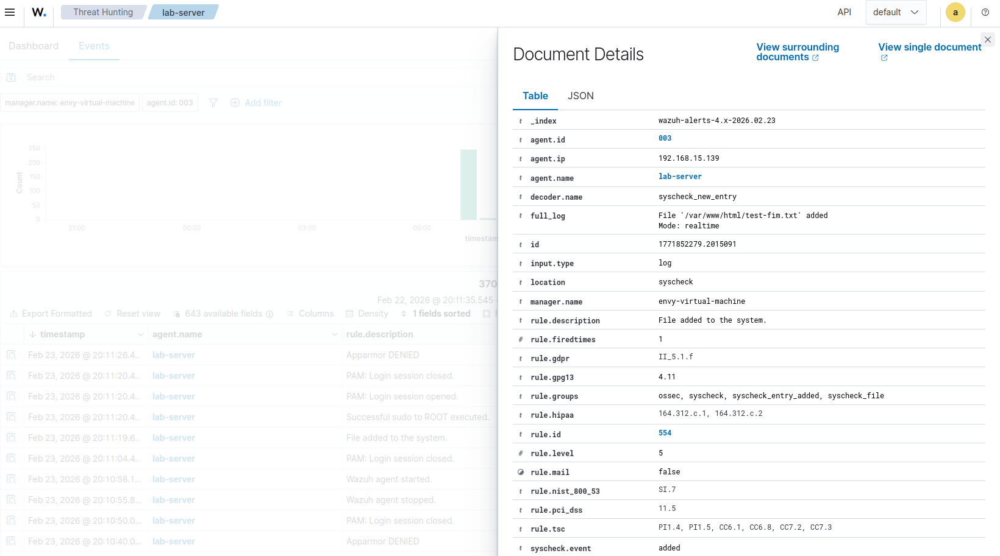

# 🛡️ Threat Detection Lab with Wazuh SIEM/EDR

Repositori ini mendokumentasikan implementasi dan simulasi deteksi ancaman menggunakan **Wazuh SIEM/EDR**. Fokus utama lab ini adalah menganalisis metode serangan dan bagaimana sistem keamanan merespons setiap aktivitas mencurigakan secara *real-time*.

## 🏗️ Infrastruktur & Persiapan
Sebelum memulai simulasi, dipastikan seluruh layanan dan agent dalam kondisi aktif.

* **Agent Status**: Dashboard menunjukkan Agent `lab-server` aktif.
* **Service Check**: Layanan Apache dan SSH dipastikan berjalan pada target.
* **Attack Surface**: Halaman web yang rentan disiapkan untuk simulasi.

*Gambar: Verifikasi koneksi Agent ke Manager*

---

## ⚔️ Metode Serangan 1: Remote Code Execution (RCE)
Serangan ini memanfaatkan celah *Command Injection* pada aplikasi web.

### 🛠️ Langkah Eksekusi (Attacker)
1. Penyerang mencoba menjalankan perintah sistem melalui parameter URL.
2. Berhasil mendapatkan akses ke file sensitif `/etc/passwd`.

*Gambar: Eksekusi payload dari terminal Kali Linux*

### 🛡️ Analisis Deteksi (SOC)
1. **Detection Logic**: Menggunakan Custom Rule ID 100005.
2. **Timeline Analysis**: Urutan kejadian tercatat lengkap di dashboard.

.png)

---

## 🔑 Metode Serangan 2: SSH Brute Force
Percobaan masuk ke sistem menggunakan metode menebak password secara masif.

### 🛠️ Langkah Eksekusi (Attacker)
Menggunakan alat **Hydra** untuk menyerang layanan SSH pada target. Proses dihentikan setelah ribuan percobaan dilakukan.

### 🛡️ Analisis Deteksi (SOC)
1. **Alert Spike**: Terlihat lonjakan aktivitas pada grafik dashboard.
2. **Detailed Logs**: Detail kegagalan login terekam pada level user dan modul PAM.

---

## 🔍 Metode Serangan 3: Post-Exploitation (FIM)
Mendeteksi perubahan integritas file setelah penyerang berhasil masuk.

### 🛠️ Langkah Eksekusi (Attacker)
Penyerang membuat file baru `test-fim.txt` di direktori web server.

### 🛡️ Analisis Deteksi (SOC)
Sistem mendeteksi penambahan file secara *real-time*. Detail log JSON menunjukkan path file dan tipe event.

---

## ⚙️ Bukti Konfigurasi (Internal)
Berikut adalah konfigurasi yang menjamin deteksi di atas berjalan:
* **Custom Rule**: [img/wazuh-custom-rule-config.png](img/wazuh-custom-rule-config.png)
* **Agent Config**: [img/wazuh-agent-fim-config.png](img/wazuh-agent-fim-config.png)

---
**Author**: Muhamad Yusril Malakaini
**Year**: 2026
